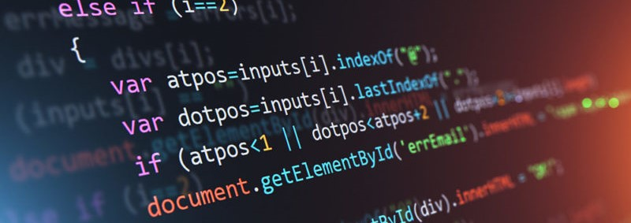
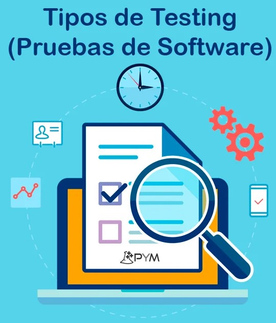

# Trabajo Pruebas de Software<
<html>

<strong><h1>🤔¿Que Son Las Pruebas De Software?🤔</h1></strong>
  
 <h4><strong>Las pruebas de software son un conjunto de actividades y procesos diseñados para evaluar y verificar la calidad, funcionamiento y rendimiento de un programa o sistema de
  software. El objetivo principal de las pruebas de software es detectar errores, defectos o problemas en el software antes de que sea lanzado o implementado en producción.  

Las pruebas de software se llevan a cabo a lo largo de todo el ciclo de vida del desarrollo de software y se enfocan en diferentes aspectos del sistema, como su funcionalidad, rendimiento, seguridad, usabilidad y compatibilidad. Estas pruebas se realizan utilizando diferentes técnicas y metodologías, y pueden involucrar la ejecución manual o automatizada de casos de prueba.</h4>
  
  
  
  
  <strong><h1>👽Tipos De Pruebas De Software👽</h1></strong>
  
 <h3> Hay una amplia variedad de pruebas de software que se pueden realizar para evaluar diferentes aspectos de un sistema. A continuación, te proporcionaré una lista más completa de las pruebas más comunes:</h3> 
<em>1.Pruebas de unidad: verifican el correcto funcionamiento de unidades individuales de código,  como funciones, métodos o clases. 

 

  2.Pruebas de integración: se centran en probar la interacción y compatibilidad entre diferentes componentes o módulos del software.

3.Pruebas de sistema: evalúan el sistema en su conjunto para asegurar que cumple con los requisitos y especificaciones establecidos.

4.Pruebas de aceptación: se realizan para verificar si el software cumple con los criterios de aceptación definidos por los usuarios, clientes o partes interesadas.

5.Pruebas de humo: pruebas rápidas y superficiales que se ejecutan para verificar si las funciones principales del software están disponibles y operativas.

6.Pruebas de regresión: se llevan a cabo después de realizar cambios en el software para asegurar que las funcionalidades previamente implementadas siguen funcionando correctamente.

7.Pruebas funcionales: evalúan si el software cumple con los requisitos funcionales y verifica el comportamiento esperado de las características del sistema.

8.Pruebas de usabilidad: se enfocan en evaluar la facilidad de uso y la experiencia del usuario del software.

9.Pruebas de rendimiento: evalúan el rendimiento, la capacidad de respuesta y la escalabilidad del software bajo diferentes condiciones de carga y estrés.

10.Pruebas de carga: verifican el rendimiento del software cuando se somete a cargas de trabajo extremas o bajo condiciones de alta demanda.

  

11.Pruebas de estrés: evalúan el comportamiento del software cuando se somete a condiciones extremas o situaciones límite.

12.Pruebas de seguridad: se realizan para identificar vulnerabilidades y riesgos de seguridad en el software y evaluar su resistencia a ataques.

13.Pruebas de compatibilidad: verifican si el software es compatible con diferentes sistemas operativos, navegadores, dispositivos u otros entornos específicos.

14.Pruebas de localización: evalúan la adaptación del software a diferentes idiomas, regiones y culturas.

15.Pruebas de recuperación de desastres: se llevan a cabo para evaluar la capacidad del software para recuperarse después de un fallo o desastre y restaurar el sistema a un estado operativo.</em>
  
   
   
<strong><h1>🤖Patrones De Desarrollo🤖</h1></strong>

  
  
  
  
  
  
  
  
  
  
</html>
