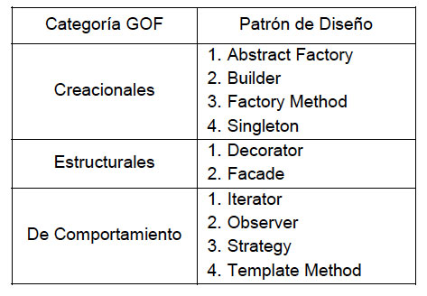

#Pruebas de Software

<html>

<strong><h1>🤔¿Que Son Las Pruebas De Software?🤔</h1></strong>
  
 <h4><strong>Las pruebas de software son un conjunto de actividades y procesos diseñados para evaluar y verificar la calidad, funcionamiento y rendimiento de un programa o sistema de software. El objetivo principal de las pruebas de software es detectar errores, defectos o problemas en el software antes de que sea lanzado o implementado en producción.  

Las pruebas de software se llevan a cabo a lo largo de todo el ciclo de vida del desarrollo de software y se enfocan en diferentes aspectos del sistema, como su funcionalidad, rendimiento, seguridad, usabilidad y compatibilidad. Estas pruebas se realizan utilizando diferentes técnicas y metodologías, y pueden involucrar la ejecución manual o automatizada de casos de prueba.</h4>
  
  
  
  
  <strong><h1>👽Tipos De Pruebas De Software👽</h1></strong>
  
 <h3> Hay una amplia variedad de pruebas de software que se pueden realizar para evaluar diferentes aspectos de un sistema:</h3> 
<em>1.Pruebas de unidad: verifican el correcto funcionamiento de unidades individuales de código,  como funciones, métodos o clases. 

 

  2.Pruebas de integración: se centran en probar la interacción y compatibilidad entre diferentes componentes o módulos del software.

3.Pruebas de sistema: evalúan el sistema en su conjunto para asegurar que cumple con los requisitos y especificaciones establecidos.

4.Pruebas de aceptación: se realizan para verificar si el software cumple con los criterios de aceptación definidos por los usuarios, clientes o partes interesadas.

5.Pruebas de humo: pruebas rápidas y superficiales que se ejecutan para verificar si las funciones principales del software están disponibles y operativas.

6.Pruebas de regresión: se llevan a cabo después de realizar cambios en el software para asegurar que las funcionalidades previamente implementadas siguen funcionando correctamente.

7.Pruebas funcionales: evalúan si el software cumple con los requisitos funcionales y verifica el comportamiento esperado de las características del sistema.

8.Pruebas de usabilidad: se enfocan en evaluar la facilidad de uso y la experiencia del usuario del software.

9.Pruebas de rendimiento: evalúan el rendimiento, la capacidad de respuesta y la escalabilidad del software bajo diferentes condiciones de carga y estrés.

10.Pruebas de carga: verifican el rendimiento del software cuando se somete a cargas de trabajo extremas o bajo condiciones de alta demanda.

  

11.Pruebas de estrés: evalúan el comportamiento del software cuando se somete a condiciones extremas o situaciones límite.

12.Pruebas de seguridad: se realizan para identificar vulnerabilidades y riesgos de seguridad en el software y evaluar su resistencia a ataques.

13.Pruebas de compatibilidad: verifican si el software es compatible con diferentes sistemas operativos, navegadores, dispositivos u otros entornos específicos.

14.Pruebas de localización: evalúan la adaptación del software a diferentes idiomas, regiones y culturas.

15.Pruebas de recuperación de desastres: se llevan a cabo para evaluar la capacidad del software para recuperarse después de un fallo o desastre y restaurar el sistema a un estado operativo.</em>
  
   
   
<strong><h1>🤖Patrones De Desarrollo🤖</h1></strong>

Los patrones de desarrollo, también conocidos como patrones de diseño o simplemente patrones, son soluciones probadas y comprobadas para problemas recurrentes en el desarrollo de software. Estos patrones representan un enfoque arquitectónico o de diseño que se puede aplicar a diferentes situaciones para resolver problemas comunes de manera efectiva. 

   Los patrones de desarrollo surgieron de la necesidad de encontrar soluciones reutilizables y estructuradas para desafíos específicos en el desarrollo de software. Fueron popularizados por el libro "Design Patterns: Elements of Reusable Object-Oriented Software" escrito por Erich Gamma, Richard Helm, Ralph Johnson y John Vlissides, comúnmente conocido como el libro de los <em>"Gang of Four" (GoF).</em>

Los patrones de desarrollo proporcionan un vocabulario común y una forma de comunicación entre los desarrolladores. Se basan en principios de diseño sólidos y encapsulan las mejores prácticas y experiencias de la industria. Al aplicar un patrón de desarrollo, los desarrolladores pueden aprovechar soluciones probadas en lugar de tener que diseñar y desarrollar desde cero.   
   

  
  <h2>Existen tres categorías principales de patrones de desarrollo:</h2>

   <em><h3>Patrones Creacionales:</h3>
Los patrones creacionales se centran en la creación de objetos de manera flexible y eficiente. Estos patrones abordan el proceso de creación de objetos y ayudan a promover la reutilización y la flexibilidad en la creación de instancias. 

Algunos ejemplos de patrones creacionales son: el Singleton, Factory Method, Abstract Factory, Builder y Prototype. Estos patrones se utilizan para controlar cómo se crean, se instancian y se configuran los objetos, permitiendo que el código sea más flexible y escalable.  

   
   
  <h3> Patrones Estructurales:</h3>
Los patrones estructurales se centran en la composición de clases y objetos para formar estructuras más grandes y flexibles. Estos patrones se utilizan para definir cómo las clases y los objetos se organizan y relacionan entre sí para lograr un sistema más flexible y eficiente.  

  
Ejemplos de patrones estructurales incluyen: el Adapter, Bridge, Composite, 
    Decorator, Facade, Flyweight y Proxy. Estos patrones se utilizan para abordar problemas relacionados con la composición de objetos, la interconexión entre diferentes partes del sistema y la simplificación de la estructura global.
  

   
   
  <h3>Patrones de Comportamiento:</h3>
Los patrones de comportamiento se centran en la interacción y comunicación entre los objetos. Estos patrones definen cómo los objetos colaboran y distribuyen responsabilidades entre sí, permitiendo un mejor diseño y una mayor flexibilidad en la implementación del comportamiento del software.  

   
 Ejemplos de patrones de comportamiento incluyen: el Observer, Strategy, Command, Template Method, Iterator, Mediator y State. Estos patrones se utilizan para definir cómo los objetos se comunican, cómo se manejan los eventos, cómo se distribuyen las tareas y cómo se implementa la lógica del comportamiento.</em>
  
  

  
  
</html>
